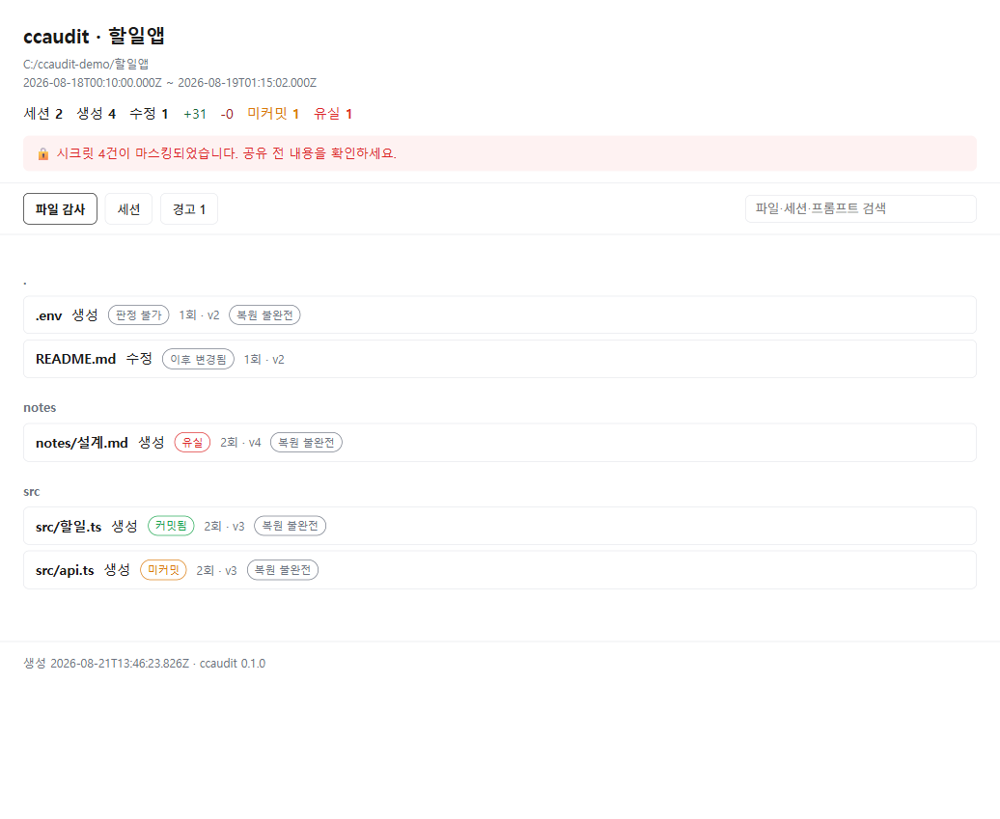
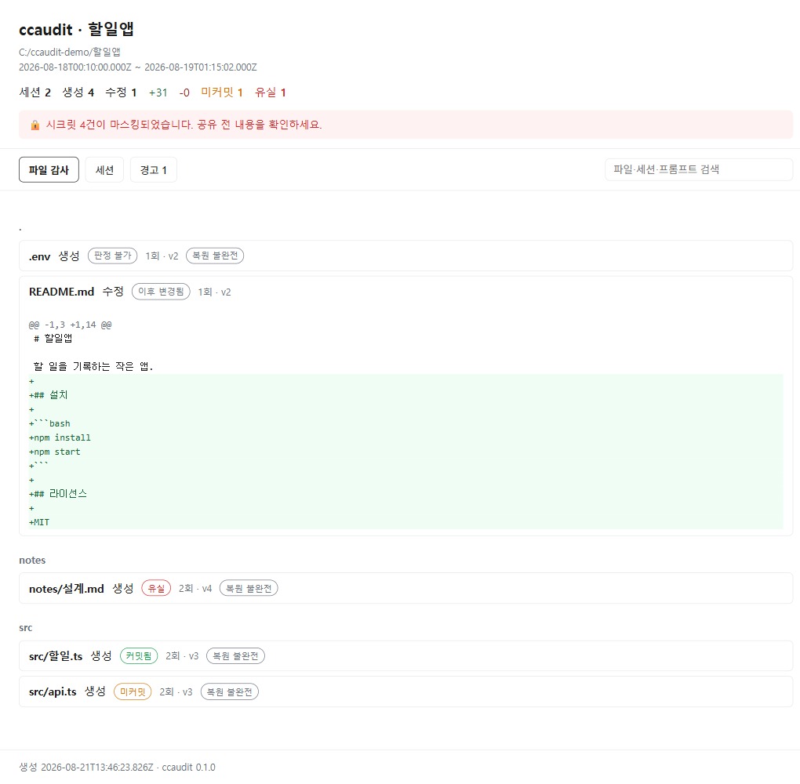

# ccaudit 결과보고서

> **제20회 오픈소스 개발자대회** 학생부문 · 자유과제 · 팀 4thIS (찬우 · 동제)
> 저장소 <https://github.com/4thIS/opensource_contest_cpt> · npm [`openccaudit`](https://www.npmjs.com/package/openccaudit) · 라이선스 MIT
> 작성일 2026-08-21 · 최종 갱신 2026-08-27

## 0. 한 줄 정의

`npx openccaudit` 한 줄로, Claude Code가 내 저장소에 **실제로 무슨 파일을 만들고 고쳤는지**를
세션 이력과 함께 **공유 가능한 단일 HTML 리포트**로 뽑아내는 CLI.

---

## 1. 문제 정의

Claude Code를 며칠 쓰면 다음 질문에 답할 수단이 없다.

- 지난 3주간 Claude Code가 **이 저장소에** 정확히 무엇을 했나?
- 어떤 세션이 이 파일을 건드렸나? 그 코드는 어떤 대화에서 나왔나?
- **커밋하지 않고 날아간 변경은 없나?**

Claude Code의 `/rewind`는 **현재 세션 안에서만** 동작한다
([공식 문서](https://code.claude.com/docs/en/checkpointing)). 세션이 끝나면 그 이력에
접근할 수단이 사라진다. 반면 데이터 자체는 `~/.claude/` 에 남아 있다 — 세션 JSONL과
`file-history/<sessionId>/<hash>@v<N>` 형태의 **버전별 파일 전문**까지.
**이미 있는 데이터인데 아무도 저장소 관점으로 읽어 주지 않는다**는 것이 이 프로젝트의 출발점이다.

## 2. 무엇이 나오나

감사할 저장소에서 한 줄이면 된다. 설치도 로그인도 없다.

```bash
npx openccaudit --open
```

```
ccaudit: ccaudit-report.html
  세션 2 · 생성 4 · 수정 1 · 미커밋 1 · 유실 1 · 마스킹 4
```

**파일 하나**가 만들어진다. 서버도 계정도 없이 팀에 그대로 보내거나 CI 아티팩트로 남길 수 있다.



파일이 1급 객체다. 각 파일에 **`커밋됨` / `미커밋` / `이후 변경됨` / `유실` / `판정 불가`**
배지가 붙고, 펼치면 Claude가 쓴 최종본과 현재 디스크 내용의 diff가 나온다.



파일에서 그 변경을 만든 **대화**로, 대화에서 다시 파일로 왕복할 수 있다.

## 3. 차별성 — "대화 뷰어"는 포화, "파일 감사"는 비어 있다

조사 결과 Claude Code 세션 뷰어는 최소 15개가 존재한다(설계 명세 2-2에 목록).

| 프로젝트 | 1급 객체 | 파일 diff | git 대조 | 유실 탐지 |
|---|---|---|---|---|
| claude-code-trace | 대화 | ✗ | ✗ | ✗ |
| claude-board | 대화 | ✗ | ✗ | ✗ |
| claude-code-chat-explorer | 대화(전문검색) | ✗ | ✗ | ✗ |
| claude-code-sessions | 세션 | ✗ | ✗ | ✗ |
| claude-history | 프롬프트 | ✗ | ✗ | ✗ |
| **ccaudit** | **파일** | **✓** | **✓ 4분류** | **✓** |

경쟁 도구는 전부 "대화를 다시 읽는" 도구다. ccaudit은 **파일을 1급 객체로 두고**
"내 저장소가 어떻게 됐나"에 답한다. 정면 경쟁을 피하면서 비어 있는 자리를 채운다.

## 4. 아키텍처

```
~/.claude/ ──▶ ① reader ──▶ ② resolver ──▶ ③ auditor ──▶ ④ renderer ──▶ report.html
```

| 단계 | 하는 일 |
|---|---|
| ① `reader` | 세션 JSONL 스트리밍 파싱 (깨진 줄은 건너뛰고, 잘린 꼬리는 '기록 중'으로 표시) |
| ② `resolver` | 기록 안의 `cwd`로 프로젝트 재구성, 파일별 git 저장소 탐색, 경로 정규화 |
| ③ `auditor` | 스냅샷 시계열 병합 → 파일별 버전 체인 복원, 백업 내용 로드, diff 생성, git 대조 |
| ④ `renderer` | 데이터·JS·CSS를 전부 인라인해 자립 HTML 한 개로 |

네트워크 통신은 어느 단계에도 없다. 로컬 파일을 읽고 HTML 하나를 쓴다.

## 5. 기술적 깊이

### 5-1. 스냅샷 시계열 병합 (핵심 알고리즘)

`file-history-delta` 레코드만으로는 파일 이력이 복원되지 않는다.
실측에서 **편집 툴콜 13회에 델타는 6개**뿐이었다. 나머지는
`file-history-snapshot.trackedFileBackups` 에 그 시점의 전체 추적 상태로만 남는다.
그래서 델타와 스냅샷을 시간순으로 병합해 파일별 버전 체인을 복원한다.
→ [`src/auditor/timeline.ts`](../src/auditor/timeline.ts) (커밋 `666e7a2`)

### 5-2. git blob 해시 기반 4분류

세션 최종본의 내용을 `blob <len>\0<content>` 의 SHA-1(= git blob 해시)로 계산해,
`git rev-list --all` + `cat-file --batch-check` 로 얻은 **그 경로의 모든 blob 집합**과
대조한다. 파일명이나 시간이 아니라 **내용**으로 판정하므로 이름이 바뀌어도 맞는다.

| 판정 | 조건 | 의미 |
|---|---|---|
| `커밋됨` | 최종본 = 디스크, git에 있음 | 정상 |
| `미커밋` | 최종본 = 디스크, git에 없음 | 커밋 필요 |
| `이후 변경됨` | 최종본 ≠ 디스크, git에 있음 | 정상 (오탐 방지) |
| **`유실`** | 최종본 ≠ 디스크, git에도 없음 | ⛔ 사라진 작업 |
| `판정 불가` | 기준선이 없음(백업 없음·git 아님·**무시되는 파일**) | 판단하지 않는다 |

→ [`src/auditor/gitstate.ts`](../src/auditor/gitstate.ts), [`src/resolver/git.ts`](../src/resolver/git.ts)

**"없는 것을 있는 것처럼 표시하지 않는다"** 를 규칙으로 삼았다. 근거가 없으면 `판정 불가`이고,
백업 구멍은 `복원 불완전` 배지로 드러낸다.

### 5-3. CJK 경로 정확 처리

Claude Code는 세션 폴더 이름을 만들 때 비ASCII 문자를 `-` 하나로 치환한다.

```
C:\Users\<id>\work\공모전\임베디드  →  C--Users-<id>-work---------
C:\Users\<id>\work\공모전\오픈소스  →  C--Users-<id>-work---------   ← 동일
```

실제로 한 폴더 안에 서로 다른 두 프로젝트의 세션이 섞여 있었다. 게다가 한 세션은 도중에
`cwd` 가 바뀌어 **"세션 하나 = 프로젝트 하나"라는 가정 자체가 성립하지 않았다.**
ccaudit은 폴더 이름을 판정에 쓰지 않고 **JSONL 안의 `cwd` 로 프로젝트를 재구성**한다.
→ [`src/resolver/projects.ts`](../src/resolver/projects.ts) (커밋 `88909af`)

## 6. 실증 — 실제 데이터로 잡은 버그들

픽스처는 우리가 만든 것이라 우리 가정만 검증한다. 그래서 **실제 `~/.claude` 로 도그푸딩**했고
(세션 5개·파일 63개), 합성 데이터로는 절대 나오지 않는 함정 3개를 잡았다.

| 발견 | 증상 | 수정 |
|---|---|---|
| 세션을 이어받으면(resume) 이전 대화가 새 세션 파일에 통째로 복제된다 (uuid 290개 중복) | 세션 수·터치·버전 체인·토큰이 두 배 | `e5b1bc7` + `tests/fixtures/resumed-session` |
| `.gitignore` 로 무시되는 파일에 `유실` 판정 | 커밋될 수 없는 파일이라 git이 기준선이 못 되는데 ⛔ 경보 | `37dfa51` |
| 도구 자신의 스크래치패드·세션 홈 쓰기를 경고 | 경고 13건 **전부** 도구 자신의 파일 | `0949e3f` |

수정 후 같은 데이터: 세션 5 · 생성 55 · 수정 3 · 미커밋 0 · **유실 0 · 경고 0** · 마스킹 8.
**거짓 경보를 0으로 만든 것이 이 단계의 성과다** — 경보가 시끄러우면 진짜 유실이 묻힌다.

## 7. 완성도

- **테스트 183개**, 픽스처 7종(CJK 충돌 / cwd 이동 / null 백업 / 깨진 줄 / 진행 중 /
  no-git / 이어받기 중복). 각 픽스처가 담당하는 함정은 `tests/fixtures/README.md` 에 있다.
- **3-OS × Node 18·20 = 6잡 CI 그린**
  → main 머지 커밋 [run 32687991851](https://github.com/4thIS/opensource_contest_cpt/actions/runs/32687991851)
- **골든 스냅샷 테스트**로 리포트 구조 회귀를 잡는다.
- **부분 실패 내성**: 깨진 JSONL 줄은 건너뛰고, git이 없어도 죽지 않고, 백업이 없으면
  `판정 불가`로 남긴다. 어느 실패도 리포트 생성을 중단시키지 않는다.
- **배포 크기 22.2 kB / 7파일** (`dist` + 문서만). 런타임 의존성 1개.

## 8. 보안

리포트에는 대화와 파일 내용이 들어간다. 공유 가능한 산출물이라는 장점이 그대로 유출
경로가 되므로 **시크릿 마스킹을 기본 활성화**했다(`--no-redact` 로만 해제).
`sk-…`, `ghp_…`/`github_pat_…`, AWS 액세스 키, `PRIVATE KEY` 블록, 슬랙 토큰,
그리고 `.env`·SSH 개인키 파일은 **내용 전체**를 가린다. 마스킹 건수는 리포트 상단에
표시해 공유 전에 확인하게 한다. → [`src/redact/secrets.ts`](../src/redact/secrets.ts) (커밋 `8c9242e`)

## 9. 오픈소스 생태계 기여

- **알려진 미해결 플랫폼 결함을 우회한다**: 비ASCII 경로 폴더명 충돌은 업스트림에 최소 4회
  보고됐고(#19972 · #30244 · #35162 · #40946) **전부 `NOT_PLANNED` 로 닫혔다.** 즉 이 데이터를
  읽는 도구들은 앞으로도 이 결함 위에서 동작해야 한다. ccaudit은 폴더 이름을 판정에 쓰지 않아
  이 결함의 영향을 받지 않는다. 조사 내역은 [`docs/upstream-issue.md`](upstream-issue.md).
- **라이선스 검증 중 발견**: esbuild가 `diff`(BSD-3-Clause)를 번들에 넣는데 배포물에
  저작권 고지가 없었다(2항 위반). `THIRD-PARTY-NOTICES.md` 를 만들어 함께 배포하도록 고쳤다.
  → [`docs/license-report.md`](license-report.md)
- **재사용 가능한 형태**: npm 패키지([`openccaudit`](https://www.npmjs.com/package/openccaudit))이자 CI 아티팩트 생성기.
  판정 로직은 순수 함수라(`classify`, `shouldWarnMissingBackup`, `dropResumedDuplicates`)
  다른 도구가 가져다 쓰기 쉽다.

## 10. 왜 오픈소스인가

Claude Code의 파일 이력 데이터는 **사용자 자신의 데이터**다. 그 데이터를 해석하는 도구가
닫혀 있으면 사용자는 자기 작업 이력을 남의 서비스에 맡겨야 한다. ccaudit은 로컬에서
돌고, 네트워크를 쓰지 않고, 결과물이 파일 하나다. 판정 규칙(`유실`이 무엇인가, 어디까지
경고할 것인가)은 팀마다 다르므로 **규칙에 기여할 수 있는 구조**로 열어 둔다.

## 11. 검증된 사실

이 보고서의 주장은 전부 실행 결과이거나 코드·커밋·CI 링크로 확인할 수 있다.

| 항목 | 확인 |
|---|---|
| 라이선스 | MIT, 저작권 줄 채워짐 · 번들 의존성 고지는 `THIRD-PARTY-NOTICES.md` |
| 테스트 | 183개 통과 / 17개 파일 |
| CI | 3-OS × Node 18·20 = 6잡 그린 |
| 배포 | npm `openccaudit@0.1.0`, 태그 `v0.1.0` |
| 무설치 실행 | 저장소 밖에서 `npx openccaudit --help` 동작 확인 |
| 시연영상 | [YouTube](https://www.youtube.com/watch?v=KLH3u8yIG7A) |
